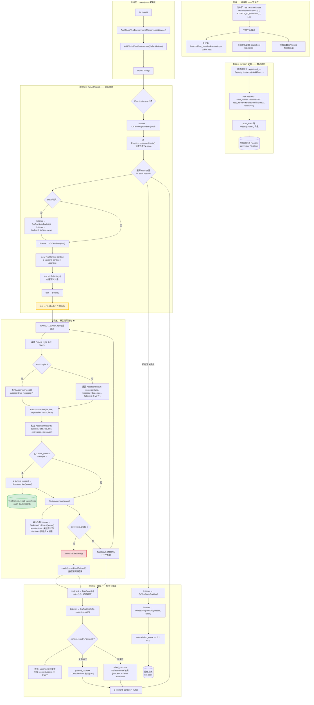
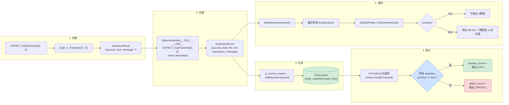
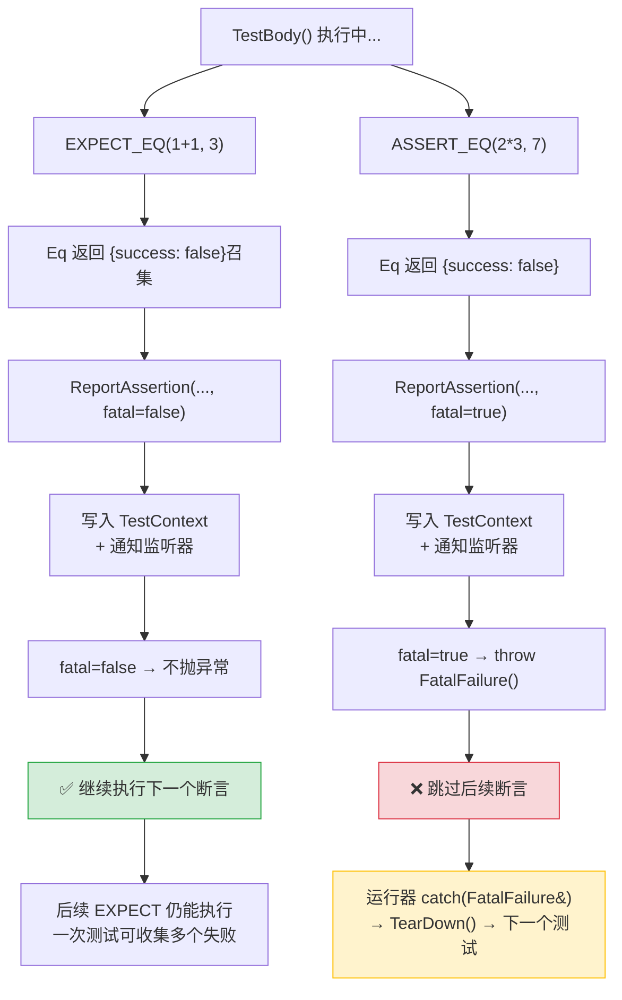
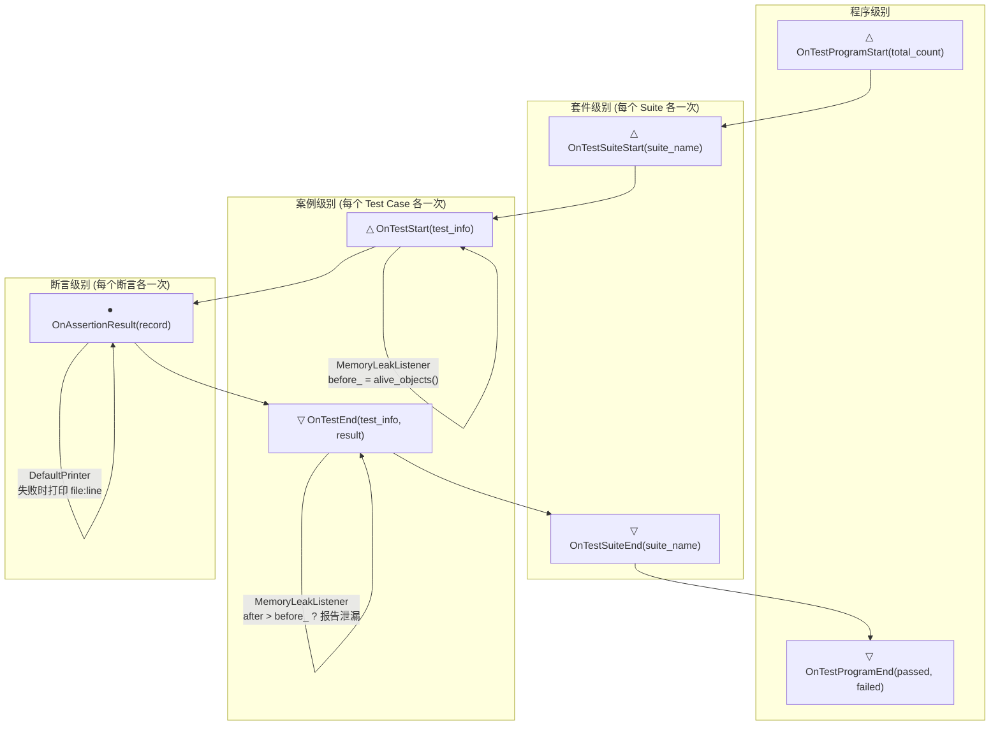
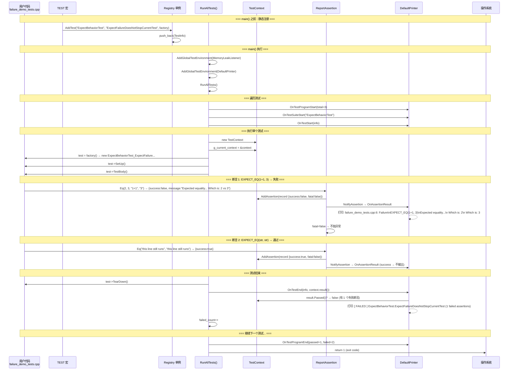

# GoogleTest 原理学习笔记

> 来源整理：
>
> - GoogleTest 的通用测试框架原理
> - 本目录 `mini_gtest/` 中的简易实现：`mini_gtest.h`、`main.cpp`、`pass_demo_tests.cpp`、`failure_demo_tests.cpp`
> - `问答.md` 中学习过程里的问题与解答
>
> 这份笔记的目标不是逐行复刻真实 GoogleTest 源码，而是抓住 GoogleTest 最核心的框架思想：**测试注册、测试发现、测试执行、断言收集、事件通知、结果汇总**。

---

## 1. 先建立整体认知

GoogleTest 表面上看起来很简单：

```cpp
TEST(MathTest, Add) {
  EXPECT_EQ(1 + 1, 2);
}

int main(int argc, char** argv) {
  testing::InitGoogleTest(&argc, argv);
  return RUN_ALL_TESTS();
}
```

但它背后并不是“运行时扫描所有函数”，C++ 本身也没有像 Java、Python 那样方便的运行时反射机制。GoogleTest 的核心做法是：

1. 用 `TEST`、`TEST_F` 等宏把用户写的测试代码包装成测试类。
2. 用静态变量在 `main()` 之前自动注册测试信息。
3. 把所有测试的元信息保存到全局注册表中。
4. `RUN_ALL_TESTS()` 从注册表中取出所有测试。
5. 框架逐个构造测试对象，调用 `SetUp()`、测试体、`TearDown()`。
6. 测试体里的 `EXPECT_*`、`ASSERT_*` 断言宏把断言结果写入当前测试上下文。
7. 事件监听器负责输出日志、生成报告、统计结果。
8. 全部执行完后，根据是否存在失败测试返回退出码。

可以把它压缩成一句话：

> GoogleTest 是一个基于 **宏展开 + 静态注册 + 统一运行器 + 断言上报 + 事件监听** 的 C++ 单元测试框架。

---

## 2. GoogleTest 的核心组成

### 2.1 测试宏：`TEST` 和 `TEST_F`

#### `TEST`

`TEST(TestSuiteName, TestName)` 用于定义一个普通测试。

例如：

```cpp
TEST(FactorialTest, HandlesPositiveInput) {
  EXPECT_EQ(Factorial(1), 1);
  EXPECT_EQ(Factorial(2), 2);
  EXPECT_EQ(Factorial(3), 6);
  EXPECT_EQ(Factorial(5), 120);
}
```

它看起来像一个函数，实际上通常会被宏展开成类似结构：

```cpp
class FactorialTest_HandlesPositiveInput : public testing::Test {
 public:
  void TestBody() override;

 private:
  static bool registered_;
};

bool FactorialTest_HandlesPositiveInput::registered_ =
    RegisterTest("FactorialTest", "HandlesPositiveInput", [] {
      return new FactorialTest_HandlesPositiveInput;
    });

void FactorialTest_HandlesPositiveInput::TestBody() {
  EXPECT_EQ(Factorial(1), 1);
  EXPECT_EQ(Factorial(2), 2);
  EXPECT_EQ(Factorial(3), 6);
  EXPECT_EQ(Factorial(5), 120);
}
```

所以 `TEST` 宏做了三件事：

1. 生成一个测试类。
2. 生成一个静态注册变量。
3. 把用户写在 `{}` 里的代码变成该测试类的 `TestBody()` 实现。

#### `TEST_F`

`TEST_F(FixtureName, TestName)` 用于定义带夹具 fixture 的测试。

fixture 的作用是复用测试前置状态，例如：

```cpp
class QueueTest : public mini_testing::Test {
 protected:
  void SetUp() override {
    q1_.push(1);
    q2_.push(2);
    q2_.push(3);
  }

  std::queue<int> q0_;
  std::queue<int> q1_;
  std::queue<int> q2_;
};

TEST_F(QueueTest, IsEmptyInitially) {
  EXPECT_TRUE(q0_.empty());
  EXPECT_EQ(q1_.size(), 1u);
  EXPECT_EQ(q2_.size(), 2u);
}
```

`TEST_F` 和 `TEST` 的主要区别是：

- `TEST` 生成的类直接继承测试基类。
- `TEST_F` 生成的类继承用户自定义 fixture。
- fixture 中可以定义成员变量、`SetUp()`、`TearDown()`。
- 每个测试都会创建新的 fixture 对象，所以不同测试之间不会共享同一个对象状态。

---

### 2.2 测试基类：`testing::Test`

GoogleTest 中所有测试对象通常都继承自 `testing::Test`。

它的核心接口可以理解为：

```cpp
class Test {
 public:
  virtual ~Test() = default;
  virtual void SetUp() {}
  virtual void TearDown() {}
  virtual void TestBody() = 0;
};
```

三个关键函数：

| 函数         | 作用                                        |
| ------------ | ------------------------------------------- |
| `SetUp()`    | 每个测试执行前调用，用于准备测试环境        |
| `TestBody()` | 真正的测试主体，由 `TEST` / `TEST_F` 宏生成 |
| `TearDown()` | 每个测试执行后调用，用于清理资源            |

重点：

> `TestBody()` 不是靠返回值判断测试是否成功，而是测试体执行期间的断言宏主动把结果上报给框架。

也就是说，框架不是这样判断的：

```cpp
bool ok = test->TestBody();
```

而是这样：

```cpp
test->TestBody();
// TestBody 运行过程中，EXPECT/ASSERT 已经把断言结果记录进当前上下文
result.Passed();
```

---

### 2.3 测试元信息：`TestInfo`

真实 GoogleTest 中有类似 `TestInfo` 的概念，用来描述一个测试。简易框架中对应的是：

```cpp
struct TestInfo {
  std::string suite_name;
  std::string test_name;
  TestFactory factory;
};
```

它记录：

| 字段         | 含义                                |
| ------------ | ----------------------------------- |
| `suite_name` | 测试套件名，例如 `FactorialTest`    |
| `test_name`  | 测试名，例如 `HandlesPositiveInput` |
| `factory`    | 创建该测试对象的工厂函数            |

#### 为什么不把这些信息直接放进 `Test` 基类？

这是 `问答.md` 中的一个关键问题。

原因是：`Test` 和 `TestInfo` 负责的阶段不同。

| 对象       | 角色                    | 存在时机                 |
| ---------- | ----------------------- | ------------------------ |
| `TestInfo` | 测试目录项 / 测试元信息 | 在测试对象创建之前就存在 |
| `Test`     | 真正被执行的测试对象    | 运行某个测试时才临时创建 |

如果没有 `TestInfo`，框架在创建测试对象之前就不知道：

- 有哪些测试？
- 每个测试叫什么？
- 属于哪个 suite？
- 怎么创建对应测试对象？
- 怎么做过滤、排序、分组、输出日志？

所以 `TestInfo` 更像“测试登记表中的一行”，而 `Test` 是“真正拿出来执行的对象”。

---

### 2.4 注册表：`Registry`

简易框架中的注册表：

```cpp
class Registry {
 public:
  static Registry& Instance();
  bool AddTest(std::string suite_name, std::string test_name, TestFactory factory);
  const std::vector<TestInfo>& tests() const;

 private:
  std::vector<TestInfo> tests_;
};
```

作用：保存所有测试的 `TestInfo`。

核心思想：

1. 每个 `TEST` / `TEST_F` 宏展开后，都会生成一个静态变量。
2. 这个静态变量在 `main()` 之前初始化。
3. 初始化时调用 `Registry::Instance().AddTest(...)`。
4. 所有测试就自动进入了全局注册表。

这就是 GoogleTest 中“写完测试后不需要手动列举测试函数”的核心原因。

---

### 2.5 运行器：`RUN_ALL_TESTS()`

`RUN_ALL_TESTS()` 是测试执行总入口。

在真实 GoogleTest 中，通常写法是：

```cpp
int main(int argc, char** argv) {
  testing::InitGoogleTest(&argc, argv);
  return RUN_ALL_TESTS();
}
```

在这个简易框架中：

```cpp
int main() {
  mini_testing::AddGlobalTestEnvironment(
      std::make_unique<mini_testing::MemoryLeakListener>());
  mini_testing::AddGlobalTestEnvironment(
      std::make_unique<mini_testing::DefaultPrinter>());

  return RUN_ALL_TESTS();
}
```

运行器负责：

1. 读取注册表中的所有测试。
2. 通知监听器：测试程序开始。
3. 按 suite 遍历测试。
4. 对每个测试：
   - 创建测试上下文。
   - 创建测试对象。
   - 调用 `SetUp()`。
   - 调用 `TestBody()`。
   - 调用 `TearDown()`。
   - 汇总断言结果。
5. 通知监听器：测试程序结束。
6. 如果全部通过，返回 `0`；否则返回 `1`。

返回码非常重要：CI/CD 系统通常就是根据进程退出码判断测试是否失败。

---

## 3. 断言系统原理

### 3.1 `EXPECT_*` 与 `ASSERT_*` 的区别

GoogleTest 里最常见的两类断言是：

| 类型       | 失败后行为                     | 使用场景                                     |
| ---------- | ------------------------------ | -------------------------------------------- |
| `EXPECT_*` | 记录失败，但当前测试继续执行   | 一般业务检查，希望一次看到多个失败点         |
| `ASSERT_*` | 记录失败，并立即终止当前测试体 | 前置条件检查，失败后继续执行可能无意义或危险 |

例如：

```cpp
EXPECT_EQ(1 + 1, 3);
EXPECT_TRUE(true);  // 即使上一条失败，这条仍然会执行
```

而：

```cpp
ASSERT_NE(ptr, nullptr);
EXPECT_EQ(*ptr, 42);  // 如果 ptr 为空，这里不应该继续执行
```

`ASSERT_*` 只终止**当前测试体**，不会终止整个测试程序。后续其他测试仍然会继续运行。

---

### 3.2 断言不是直接打印，而是先记录结果

以 `EXPECT_EQ(left, right)` 为例，它大致会展开为：

```cpp
mini_testing::ReportAssertion(
    __FILE__,
    __LINE__,
    "EXPECT_EQ(left, right)",
    mini_testing::Eq((left), (right), "left", "right"),
    false);
```

这里做了几件事：

1. `Eq(...)` 负责真正比较左右值。
2. 如果比较失败，生成详细失败消息。
3. `ReportAssertion(...)` 把结果包装成 `AssertionRecord`。
4. `AssertionRecord` 写入当前测试上下文。
5. 同时通知事件监听器。
6. 如果是 `ASSERT_*` 并且失败，则触发当前测试体中止。

---

### 3.3 断言结果对象：`AssertionResult` 和 `AssertionRecord`

简易框架中有两个相关结构：

```cpp
struct AssertionResult {
  bool success = true;
  std::string message;
};
```

`AssertionResult` 是断言判断函数的轻量返回值，表示“这次判断是否成功，如果失败，失败信息是什么”。

```cpp
struct AssertionRecord {
  bool success = true;
  bool fatal = false;
  std::string file;
  int line = 0;
  std::string expression;
  std::string message;
};
```

`AssertionRecord` 是最终记录到测试结果中的完整断言记录，包含：

- 是否成功
- 是否致命
- 文件名
- 行号
- 表达式文本
- 失败消息

可以理解为：

> `AssertionResult` 是判断结果，`AssertionRecord` 是带现场信息的完整断言日志。

---

### 3.4 当前测试上下文：`TestContext`

这是 `问答.md` 中重点讨论过的问题。

简易框架中：

```cpp
class TestContext {
 public:
  void AddAssertion(AssertionRecord record) {
    result_.assertions.push_back(std::move(record));
  }

  TestResult& result() { return result_; }

 private:
  TestResult result_;
};

inline TestContext* g_current_context = nullptr;
```

每运行一个测试，运行器都会创建一个新的 `TestContext`：

```cpp
TestContext context;
g_current_context = &context;
```

之后这个测试体里的每一次断言，都会通过 `g_current_context` 找到当前测试上下文，并把断言记录写入：

```cpp
g_current_context->AddAssertion(record);
```

所以可以这样理解：

- 一个 `TEST` 定义的是一个测试。
- 每次执行这个测试时，会有一个新的 `TestContext`。
- 该测试体里的所有断言，都会写入这个上下文中的 `assertions` 向量。
- 测试结束后，运行器通过这个上下文判断该测试通过还是失败。

一句话总结：

> `TestContext` 是“断言发生点”和“运行器统计结果”之间的数据桥。

---

### 3.5 `ASSERT_*` 如何中止当前测试？

简易框架中通过异常实现：

```cpp
class FatalFailure final : public std::exception {
 public:
  const char* what() const noexcept override { return "fatal assertion failed"; }
};
```

当 `ReportAssertion(...)` 发现：

- 当前断言失败；
- 并且它是 fatal 断言，也就是 `ASSERT_*`；

就会抛出 `FatalFailure`：

```cpp
if (!record.success && fatal) {
  throw FatalFailure();
}
```

运行器捕获这个异常：

```cpp
try {
  test = info.factory();
  test->SetUp();
  test->TestBody();
} catch (const FatalFailure&) {
  // ASSERT_* 到这里结束当前测试体。
}
```

这样可以做到：

- 当前测试体立即停止；
- `TearDown()` 仍然有机会执行；
- 后续测试继续运行；
- 整个测试程序不会崩溃。

真实 GoogleTest 内部实现细节更复杂，但“致命断言只终止当前测试、不终止整个测试程序”是同一个使用层面的核心语义。

---

## 4. 事件监听机制

GoogleTest 有事件监听器机制，可以在测试生命周期中插入回调。

简易框架中的监听器接口：

```cpp
class EventListener {
 public:
  virtual void OnTestProgramStart(int total_test_count) {}
  virtual void OnTestProgramEnd(int passed_count, int failed_count) {}
  virtual void OnTestSuiteStart(const std::string& suite_name) {}
  virtual void OnTestSuiteEnd(const std::string& suite_name) {}
  virtual void OnTestStart(const TestInfo& test_info) {}
  virtual void OnAssertionResult(const AssertionRecord& assertion) {}
  virtual void OnTestEnd(const TestInfo& test_info, const TestResult& result) {}
};
```

它体现的是观察者模式：

- 运行器不直接关心“怎么打印”。
- 运行器只在关键节点广播事件。
- 具体监听器决定如何响应这些事件。

### 4.1 默认打印器：`DefaultPrinter`

`DefaultPrinter` 负责输出类似 GoogleTest 的控制台日志：

```text
[==========] Running 7 tests.
[----------] FactorialTest
[ RUN      ] FactorialTest.HandlesPositiveInput
[       OK ] FactorialTest.HandlesPositiveInput
[==========] Done.
[  PASSED  ] 7 tests.
```

如果断言失败，则输出：

```text
path/to/file.cpp:6: Failure
EXPECT_EQ(1 + 1, 3)
Expected equality of these values:
  1 + 1
    Which is: 2
  3
    Which is: 3
```

### 4.2 内存泄漏监听器：`MemoryLeakListener`

简易框架还实现了一个教学用的内存泄漏监听器。

基本思路：

1. `OnTestStart` 时记录当前存活对象数。
2. `OnTestEnd` 时再次检查存活对象数。
3. 如果测试结束后对象数增加，说明可能有对象没有释放。
4. 通过 `ReportAssertion` 报告一次失败。

配合：

```cpp
#define MGT_NEW(type, ...) ::mini_testing::TrackedNew<type>(__VA_ARGS__)
#define MGT_DELETE(ptr) ::mini_testing::TrackedDelete(ptr)
```

注意：这只是教学演示，不是完整内存检测工具。它只统计通过 `MGT_NEW` / `MGT_DELETE` 创建和释放的对象。

---

## 5. 简易框架 mini_gtest 的完整结构

本目录中的简易框架集中在 `mini_gtest/mini_gtest.h` 中。

### 5.1 文件角色

| 文件                     | 作用                                                      |
| ------------------------ | --------------------------------------------------------- |
| `mini_gtest.h`           | 框架主体：基类、注册表、断言、运行器、宏、监听器          |
| `main.cpp`               | 注册监听器并调用 `RUN_ALL_TESTS()`                        |
| `pass_demo_tests.cpp`    | 全部通过的示例测试                                        |
| `failure_demo_tests.cpp` | 故意失败的示例，用于观察 `EXPECT`、`ASSERT`、泄漏检测行为 |
| `README.md`              | 项目说明、构建和运行命令                                  |

---

### 5.2 核心类和结构体总览

| 名称                 | 类型     | 作用                            |
| -------------------- | -------- | ------------------------------- |
| `FatalFailure`       | 异常类   | `ASSERT_*` 失败时中止当前测试体 |
| `AssertionRecord`    | 结构体   | 一条完整断言记录                |
| `TestResult`         | 结构体   | 一个测试的所有断言结果集合      |
| `TestContext`        | 类       | 当前测试执行上下文              |
| `Test`               | 抽象基类 | 所有测试类的共同基类            |
| `TestInfo`           | 结构体   | 注册表中的测试元信息            |
| `Registry`           | 单例类   | 保存所有已注册测试              |
| `EventListener`      | 接口类   | 测试生命周期事件回调接口        |
| `EventListeners`     | 单例类   | 保存所有监听器                  |
| `DefaultPrinter`     | 监听器   | 默认控制台输出器                |
| `AssertionResult`    | 结构体   | 断言判断函数返回值              |
| `MemoryTracker`      | 单例类   | 教学用内存计数器                |
| `MemoryLeakListener` | 监听器   | 教学用内存泄漏检测监听器        |

---

### 5.3 关键宏总览

| 宏                        | 作用                  |
| ------------------------- | --------------------- |
| `TEST(suite, name)`       | 定义普通测试          |
| `TEST_F(fixture, name)`   | 定义带 fixture 的测试 |
| `EXPECT_TRUE(condition)`  | 非致命真值断言        |
| `ASSERT_TRUE(condition)`  | 致命真值断言          |
| `EXPECT_FALSE(condition)` | 非致命假值断言        |
| `ASSERT_FALSE(condition)` | 致命假值断言          |
| `EXPECT_EQ(left, right)`  | 非致命相等断言        |
| `ASSERT_EQ(left, right)`  | 致命相等断言          |
| `EXPECT_NE(left, right)`  | 非致命不等断言        |
| `ASSERT_NE(left, right)`  | 致命不等断言          |
| `EXPECT_LT(left, right)`  | 非致命小于断言        |
| `ASSERT_LT(left, right)`  | 致命小于断言          |
| `RUN_ALL_TESTS()`         | 执行所有已注册测试    |
| `MGT_NEW` / `MGT_DELETE`  | 教学用内存追踪包装    |

---

## 6. mini_gtest 的完整执行流程

### 6.1 总流程

从程序启动到退出，完整流程如下：

1. 程序加载，开始静态初始化。
2. 各测试文件中 `TEST` / `TEST_F` 宏生成的静态注册变量执行。
3. 静态注册变量调用 `Registry::Instance().AddTest(...)`。
4. 所有测试元信息进入全局注册表。
5. 进入 `main()`。
6. `main()` 注册监听器：
   - `MemoryLeakListener`
   - `DefaultPrinter`
7. `main()` 调用 `RUN_ALL_TESTS()`。
8. `RUN_ALL_TESTS()` 转发到 `RunAllTests()`。
9. `RunAllTests()` 读取注册表中的测试列表。
10. 广播 `OnTestProgramStart(total_count)`。
11. 遍历每个测试。
12. 如果 suite 发生切换，广播 suite 开始 / 结束事件。
13. 对每个测试广播 `OnTestStart(info)`。
14. 创建 `TestContext context`。
15. 设置 `g_current_context = &context`。
16. 通过 `TestInfo.factory` 创建测试对象。
17. 调用 `test->SetUp()`。
18. 调用 `test->TestBody()`。
19. 测试体中的每个断言都调用 `ReportAssertion(...)`。
20. `ReportAssertion(...)` 将断言写入当前 `TestContext`。
21. 如果是失败的 `ASSERT_*`，抛出 `FatalFailure`。
22. 运行器捕获 `FatalFailure`，结束当前测试体。
23. 调用 `test->TearDown()`。
24. 广播 `OnTestEnd(info, context.result())`。
25. 根据 `context.result().Passed()` 统计通过或失败。
26. 清空 `g_current_context`。
27. 所有测试结束后广播 `OnTestProgramEnd(passed_count, failed_count)`。
28. 如果失败数为 0，返回 `0`；否则返回 `1`。

---

### 6.2 用一个具体 `TEST` 追踪完整流程

以 `pass_demo_tests.cpp` 中的测试为例：

```cpp
TEST(FactorialTest, HandlesPositiveInput) {
  EXPECT_EQ(Factorial(1), 1);
  EXPECT_EQ(Factorial(2), 2);
  EXPECT_EQ(Factorial(3), 6);
  EXPECT_EQ(Factorial(5), 120);
}
```

#### 阶段一：宏展开

这段代码大致变成：

```cpp
class FactorialTest_HandlesPositiveInput : public mini_testing::Test {
 public:
  void TestBody() override;

 private:
  static bool registered_;
};

bool FactorialTest_HandlesPositiveInput::registered_ =
    mini_testing::Registry::Instance().AddTest(
        "FactorialTest",
        "HandlesPositiveInput",
        [] {
          return std::make_unique<FactorialTest_HandlesPositiveInput>();
        });

void FactorialTest_HandlesPositiveInput::TestBody() {
  EXPECT_EQ(Factorial(1), 1);
  EXPECT_EQ(Factorial(2), 2);
  EXPECT_EQ(Factorial(3), 6);
  EXPECT_EQ(Factorial(5), 120);
}
```

重点：

- `TEST` 的 `{ ... }` 内容最终接到了 `TestBody()` 后面。
- 简易框架中对应代码是 `TEST` 宏最后两行：

```cpp
void MINI_GTEST_CONCAT(test_suite_name, MINI_GTEST_CONCAT(_, test_name))::  \
    TestBody()
```

也就是说：

```cpp
TEST(MathTest, Add) {
  EXPECT_EQ(1 + 1, 2);
}
```

会被拼成类似：

```cpp
void MathTest_Add::TestBody() {
  EXPECT_EQ(1 + 1, 2);
}
```

---

#### 阶段二：静态注册

在进入 `main()` 之前，静态变量 `registered_` 初始化。

它调用：

```cpp
Registry::Instance().AddTest(
    "FactorialTest",
    "HandlesPositiveInput",
    factory);
```

于是注册表里增加一条 `TestInfo`：

```cpp
{
  suite_name = "FactorialTest",
  test_name = "HandlesPositiveInput",
  factory = 创建 FactorialTest_HandlesPositiveInput 对象的函数
}
```

---

#### 阶段三：进入 `main()`

`main.cpp` 中：

```cpp
int main() {
  mini_testing::AddGlobalTestEnvironment(
      std::make_unique<mini_testing::MemoryLeakListener>());
  mini_testing::AddGlobalTestEnvironment(
      std::make_unique<mini_testing::DefaultPrinter>());

  return RUN_ALL_TESTS();
}
```

这里注册两个监听器，然后运行所有测试。

---

#### 阶段四：运行器开始执行

`RunAllTests()` 读取注册表，发现有 `FactorialTest.HandlesPositiveInput`。

它会广播：

```text
OnTestProgramStart(total_count)
OnTestSuiteStart("FactorialTest")
OnTestStart(TestInfo{...})
```

`DefaultPrinter` 因此打印：

```text
[==========] Running N tests.
[----------] FactorialTest
[ RUN      ] FactorialTest.HandlesPositiveInput
```

---

#### 阶段五：创建上下文和测试对象

运行器创建当前测试上下文：

```cpp
TestContext context;
g_current_context = &context;
```

然后通过工厂函数创建测试对象：

```cpp
std::unique_ptr<Test> test = info.factory();
```

接着执行：

```cpp
test->SetUp();
test->TestBody();
```

普通 `TEST` 没有重写 `SetUp()`，所以默认什么都不做。

---

#### 阶段六：执行断言

第一句：

```cpp
EXPECT_EQ(Factorial(1), 1);
```

大致展开为：

```cpp
mini_testing::ReportAssertion(
    __FILE__,
    __LINE__,
    "EXPECT_EQ(Factorial(1), 1)",
    mini_testing::Eq((Factorial(1)), (1), "Factorial(1)", "1"),
    false);
```

其中：

1. `Factorial(1)` 返回 `1`。
2. `Eq(1, 1, ...)` 判断相等，返回 `{true, ""}`。
3. `ReportAssertion(...)` 构造 `AssertionRecord`。
4. `ReportAssertion(...)` 发现 `g_current_context` 指向当前测试上下文，于是写入：

```cpp
g_current_context->AddAssertion(record);
```

后续三句 `EXPECT_EQ` 也同理。

因为这四个断言都成功，所以当前测试的 `assertions` 向量里记录的都是成功断言。

---

#### 阶段七：测试结束和结果统计

`TestBody()` 正常执行完后，运行器调用：

```cpp
test->TearDown();
```

然后广播：

```cpp
OnTestEnd(info, context.result());
```

`DefaultPrinter` 检查：

```cpp
context.result().Passed()
```

如果所有断言都成功，则输出：

```text
[       OK ] FactorialTest.HandlesPositiveInput
```

最后运行器把通过数加一。

---

## 7. 再追踪一个失败场景

### 7.1 `EXPECT` 失败但继续执行

`failure_demo_tests.cpp` 中：

```cpp
TEST(ExpectBehaviorTest, ExpectFailureDoesNotStopCurrentTest) {
  EXPECT_EQ(1 + 1, 3);

  EXPECT_EQ(std::string("this line still runs"),
            std::string("this line still runs"));
}
```

第一条断言失败：

```cpp
EXPECT_EQ(1 + 1, 3);
```

执行结果：

1. `Eq(2, 3, ...)` 返回失败。
2. `ReportAssertion(...)` 记录失败。
3. 因为 `EXPECT_EQ` 的 fatal 参数是 `false`，所以不抛异常。
4. 后面的第二条 `EXPECT_EQ` 继续执行。
5. 最终这个测试失败，但可以收集到更多信息。

---

### 7.2 `ASSERT` 失败并中止当前测试体

`failure_demo_tests.cpp` 中：

```cpp
TEST(AssertBehaviorTest, AssertFailureStopsCurrentTest) {
  ASSERT_EQ(2 * 3, 7);

  EXPECT_EQ("unreachable", "this assertion should not run");
}
```

第一条断言失败：

```cpp
ASSERT_EQ(2 * 3, 7);
```

执行结果：

1. `Eq(6, 7, ...)` 返回失败。
2. `ReportAssertion(...)` 记录失败。
3. 因为 `ASSERT_EQ` 的 fatal 参数是 `true`，所以抛出 `FatalFailure`。
4. `RunAllTests()` 捕获 `FatalFailure`。
5. 当前 `TestBody()` 结束。
6. 后面的 `EXPECT_EQ("unreachable", ...)` 不会执行。
7. 框架继续执行 `TearDown()` 和后续其他测试。

---

## 8. `TEST_F` fixture 生命周期

以 `QueueTest` 为例：

```cpp
class QueueTest : public mini_testing::Test {
 protected:
  void SetUp() override {
    q1_.push(1);
    q2_.push(2);
    q2_.push(3);
  }

  std::queue<int> q0_;
  std::queue<int> q1_;
  std::queue<int> q2_;
};
```

两个测试：

```cpp
TEST_F(QueueTest, IsEmptyInitially) { ... }
TEST_F(QueueTest, DequeueWorks) { ... }
```

执行时不是共用同一个 `QueueTest` 对象。

真实流程是：

1. 执行 `QueueTest.IsEmptyInitially`：
   - 创建一个新的 `QueueTest_IsEmptyInitially` 对象。
   - 调用 `SetUp()`。
   - 执行该测试体。
   - 调用 `TearDown()`。
   - 销毁对象。
2. 执行 `QueueTest.DequeueWorks`：
   - 再创建一个新的 `QueueTest_DequeueWorks` 对象。
   - 再调用一次 `SetUp()`。
   - 执行该测试体。
   - 调用 `TearDown()`。
   - 销毁对象。

所以 fixture 的重要原则是：

> 每个测试应当相互独立。不要依赖另一个测试执行后留下的状态。

---

## 9. 从 mini_gtest 映射到真实 GoogleTest

| mini_gtest 概念   | 真实 GoogleTest 对应概念         | 说明                                         |
| ----------------- | -------------------------------- | -------------------------------------------- |
| `TEST`            | `TEST`                           | 普通测试宏                                   |
| `TEST_F`          | `TEST_F`                         | fixture 测试宏                               |
| `Test`            | `testing::Test`                  | 测试基类                                     |
| `Registry`        | GoogleTest 内部注册机制          | 真实实现更复杂，支持过滤、参数化、死亡测试等 |
| `TestInfo`        | `testing::TestInfo` / 内部元信息 | 保存测试名称、suite、工厂等信息              |
| `RunAllTests`     | `RUN_ALL_TESTS()` / `UnitTest`   | 统一调度执行                                 |
| `EventListener`   | `testing::TestEventListener`     | 事件监听器接口                               |
| `DefaultPrinter`  | 默认结果打印器                   | 控制台输出                                   |
| `AssertionResult` | `testing::AssertionResult`       | 断言结果表达                                 |
| `EXPECT_*`        | `EXPECT_*`                       | 非致命断言                                   |
| `ASSERT_*`        | `ASSERT_*`                       | 致命断言                                     |

真实 GoogleTest 还提供更多能力：

- 测试过滤：`--gtest_filter=SuiteName.TestName`
- 重复运行：`--gtest_repeat=N`
- 打乱顺序：`--gtest_shuffle`
- XML/JSON 输出
- 参数化测试：`TEST_P`
- 类型参数测试
- 死亡测试：`EXPECT_DEATH`
- 浮点比较、字符串比较、异常断言等更丰富的断言族

但这些高级能力仍然建立在同一条主线上：

> 注册测试 → 运行测试 → 断言上报 → 事件输出 → 汇总结果。

---

## 10. 学习中几个关键问题的合并解答

### 问题 1：`TestContext` 是不是每个 `TEST` 一个上下文？

更准确地说：

> 每次执行一个测试时，运行器都会创建一个新的 `TestContext`。

这个上下文用于保存该测试执行期间产生的所有断言结果。

所以：

- 不是每个断言一个上下文。
- 也不是所有测试共用一个上下文。
- 而是每个测试执行实例一个上下文。

断言写入哪个上下文，取决于当前 `g_current_context` 指向哪里。

---

### 问题 2：为什么有了 `Test` 基类，还要有 `TestInfo`？

因为二者职责不同：

- `TestInfo` 是注册表里的“描述信息”。
- `Test` 是真正执行时创建出来的“测试对象”。

运行器必须先通过 `TestInfo` 知道有哪些测试，然后才能通过 `factory` 创建对应的 `Test` 对象。

---

### 问题 3：`TestBody()` 看起来没有实现，断言到底在哪里判断？

`Test` 基类里的 `TestBody()` 是纯虚函数，它不是最终实现。

真正的实现由 `TEST` 宏生成：

```cpp
void SomeSuite_SomeTest::TestBody() {
  // 用户写在 TEST(...) { ... } 里的代码
}
```

断言判断发生在这个函数执行期间。

例如：

```cpp
EXPECT_EQ(1 + 1, 2);
```

会调用 `Eq(...)` 判断，再调用 `ReportAssertion(...)` 上报。

所以不是 `TestBody()` 返回结果，而是断言宏在 `TestBody()` 执行期间主动记录结果。

---

### 问题 4：`TEST` 宏中哪一行体现“把 `{}` 里的内容放进 `TestBody()`”？

简易框架中 `TEST` 宏最后两行：

```cpp
void MINI_GTEST_CONCAT(test_suite_name, MINI_GTEST_CONCAT(_, test_name))::  \
    TestBody()
```

宏调用：

```cpp
TEST(MathTest, Add) {
  EXPECT_EQ(1 + 1, 2);
}
```

展开后会拼接成：

```cpp
void MathTest_Add::TestBody() {
  EXPECT_EQ(1 + 1, 2);
}
```

这就是宏语法最关键的地方：

> 宏定义停在 `TestBody()`，用户写的 `{ ... }` 会自然接到它后面，形成函数体。

---

## 11. 推荐理解路线

学习 GoogleTest 原理时，建议按下面顺序理解：

1. 先理解 `TEST` 宏不是函数，而是生成类和注册代码。
2. 再理解静态注册：为什么测试在 `main()` 前已经进入注册表。
3. 再理解 `RUN_ALL_TESTS()`：它只是统一调度注册表中的测试。
4. 再理解 `TestContext`：断言结果到底记录到哪里。
5. 再理解 `EXPECT` / `ASSERT`：非致命和致命失败的区别。
6. 再理解 fixture：每个测试独立创建对象，`SetUp()` 每次都会执行。
7. 最后理解事件监听器：输出、报告、统计都可以通过生命周期回调扩展。

---

## 12. 核心流程图（Mermaid）

### 12.1 完整调用流程 + 断言结果流向



### 12.2 断言结果数据流向图（简化版）

聚焦一个 `EXPECT_EQ` 调用，追踪数据从产生到最终输出的完整路径：



### 12.3 EXPECT vs ASSERT 分叉对比



### 12.4 事件监听器在生命周期中的触发点



### 12.5 完整的端到端追踪（以 failure_demo 为例）

以 `failure_demo_tests.cpp` 中 `ExpectBehaviorTest.ExpectFailureDoesNotStopCurrentTest` 为例：



### 12.6 核心组件关系图

```mermaid
classDiagram
    class Test {
        <<abstract>>
        +SetUp()
        +TearDown()
        +TestBody()* pure virtual
    }

    class TestInfo {
        +string suite_name
        +string test_name
        +TestFactory factory
    }

    class Registry {
        -vector~TestInfo~ tests_
        +Instance()$ Registry&
        +AddTest(suite, name, factory) bool
        +tests() vector~TestInfo~
    }

    class TestContext {
        -TestResult result_
        +AddAssertion(record)
        +result() TestResult&
    }

    class TestResult {
        -vector~AssertionRecord~ assertions
        +Passed() bool
        +FailedAssertionCount() int
    }

    class AssertionRecord {
        +bool success
        +bool fatal
        +string file
        +int line
        +string expression
        +string message
    }

    class AssertionResult {
        +bool success
        +string message
    }

    class EventListener {
        <<interface>>
        +OnTestProgramStart(int)
        +OnTestProgramEnd(int,int)
        +OnTestSuiteStart(string)
        +OnTestSuiteEnd(string)
        +OnTestStart(TestInfo)
        +OnAssertionResult(AssertionRecord)
        +OnTestEnd(TestInfo,TestResult)
    }

    class DefaultPrinter {
        +输出 GoogleTest 风格日志
    }

    class MemoryLeakListener {
        -size_t before_
        +OnTestStart: 记录 alive_objects
        +OnTestEnd: 比较并报告泄漏
    }

    class FatalFailure {
        <<exception>>
    }

    Test <|-- "TEST 宏生成" : 继承
    Test <|-- "用户 Fixture" : 继承
    "用户 Fixture" <|-- "TEST_F 宏生成" : 继承

    Registry o-- TestInfo : 存储
    TestInfo --> Test : factory 创建

    TestContext *-- TestResult
    TestResult *-- AssertionRecord

    EventListener <|-- DefaultPrinter : 实现
    EventListener <|-- MemoryLeakListener : 实现

    AssertionRecord ..> FatalFailure : fatal && !success → throw

    "全局指针 g_current_context" --> TestContext : 指向当前

    note for Registry "单例，main() 前已包含所有测试"
    note for TestInfo "注册表条目：元数据+工厂"
    note for TestContext "每个测试执行一次，new 一个实例"
    note for EventListener "观察者模式：运行器广播，监听器响应"
```

---

## 13. 一句话总结

GoogleTest 的核心不是某一个断言宏，而是一套完整的执行模型：

> 用宏把测试代码变成测试类；用静态初始化把测试注册进全局注册表；用 `RUN_ALL_TESTS()` 统一创建和执行测试对象；用断言宏把结果写入当前测试上下文；用事件监听器输出和扩展测试生命周期；最后用退出码告诉外部系统测试是否通过。
